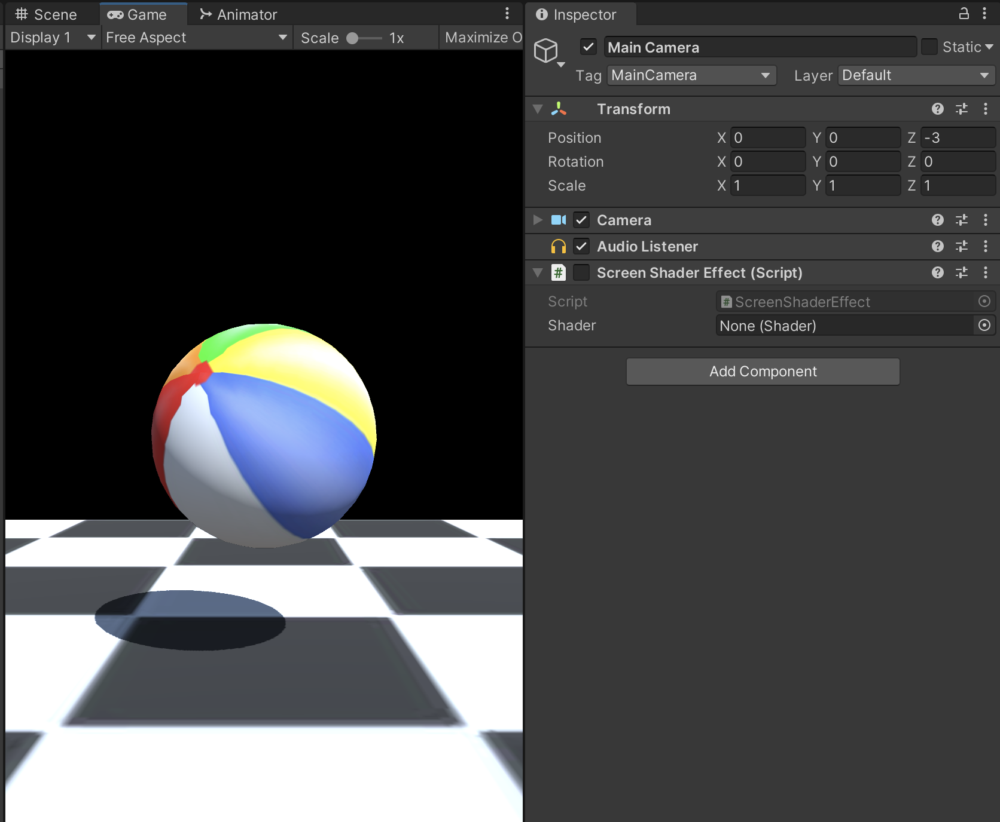
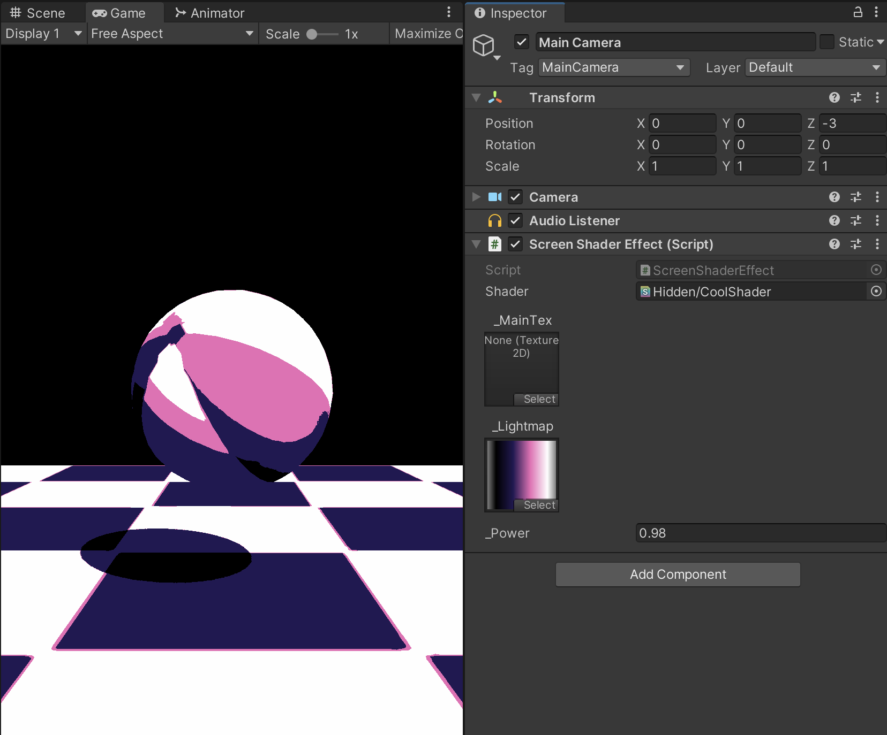

# UnityScreenShader
A single script for applying custom post-processing shader effects to your Unity project (Built-in Render Pipeline). I might update this to be better later but for right now it's pretty good.

## Instructions
Simply attach `ScreenShaderEffect.cs` to the Camera and assign your screen shader to it. All the properties of the shader will appear automagically in the inspector of the script, where they can be tweaked as necessary. No external material is required. All changes are immediately reflected in the Game view, even when the scene is not running.

If you don't know how to create the screen shader itself, a good tutorial can be found [here](https://www.alanzucconi.com/2015/07/08/screen-shaders-and-postprocessing-effects-in-unity3d/). (are they even called screen shaders? whatever)

